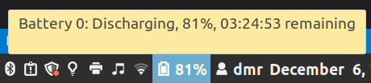

# Battery Power indicator for Linux Mint Cinnamon panels on Macbooks

Dead simple battery level indicator.

## Summary

Running Cinnamon >19 on my Macbook, even on a full charge, the battery level will start at ~60% and will report incorrect values through the entire discharge usage. I've tried recalibrating the battery by draining it then recharging it full but it not solve the issue same for trying various solutions suggested online.

The terminal command `acpi` reports the battery correctly so I wrote this simple applet which uses `acpi` to visualise the correct value on my panels.

